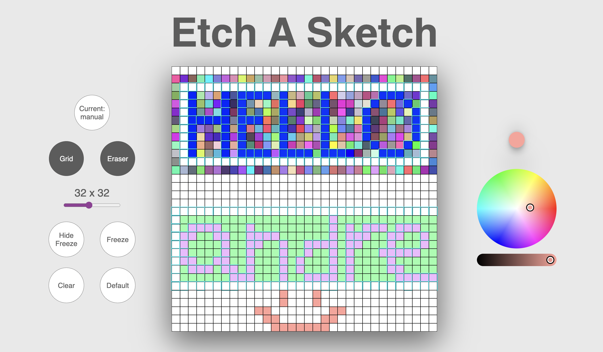
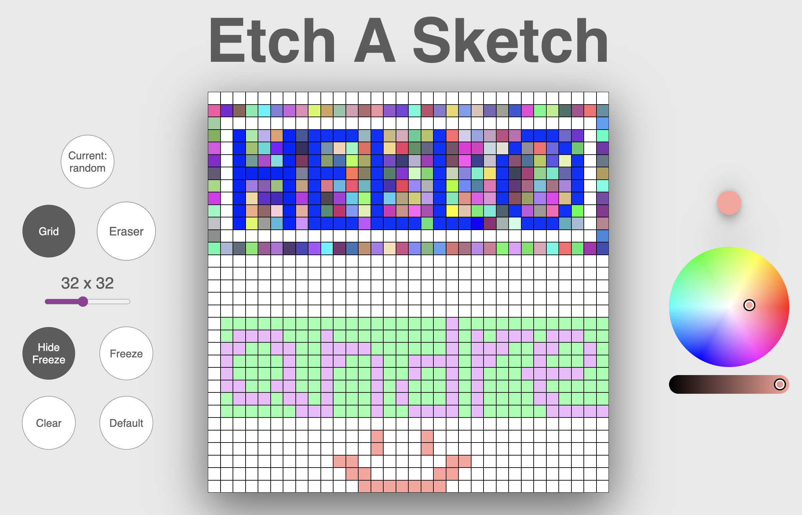

# etch-a-sketch

Project 5 of The Odin Foundations Course. 

Built a classic Etch-A-Sketch with the following functionalities:
1. Color selection & randomized mode
2. Erase function
3. Grid display feature
4. Freeze (and hide freeze display) feature
5. Clear grid & revert default functionality

## Product Display

Click [here](https://4ndrelim.github.io/etch-a-sketch/) to view!